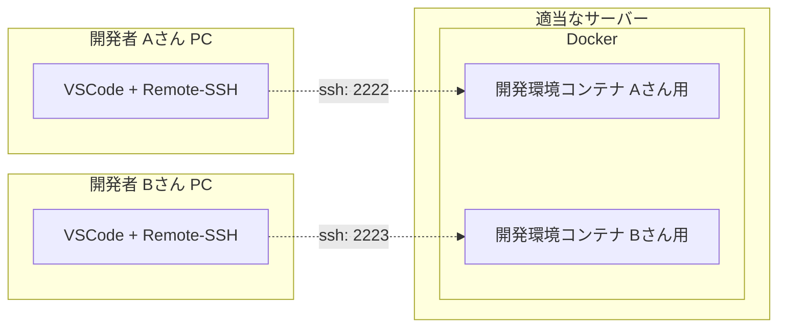
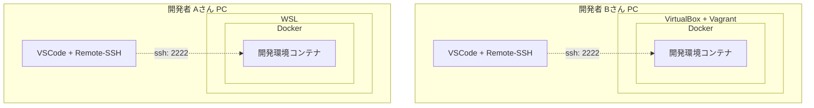
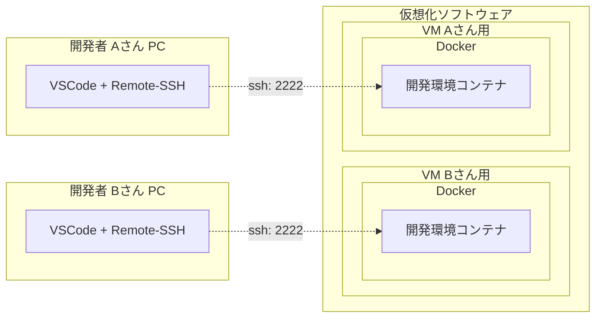

# dotnet_dev_docker_almalinux8

## 概要
* .NET の開発環境を Docker で構築する
* VSCode の Remote-SSH で接続して開発する

### その他
* 素の AlmaLinux8 をベースにし、プロジェクトに合わせて変更しやすいようにする
* 一般ユーザーを追加し、sudo が使えるようにする

## 想定する利用方法
開発者は自分の端末に VSCode、Remote-SSH だけインストールし、Docker 上に構築した開発環境コンテナに SSH で接続して開発する。

Docker の構築については以下参照。  
なお、以下の例で言うと A さん B さんで異なる方法でも良い。  

### 実現方法例１）適当なサーバー内の Docker に開発者分コンテナを立てる
* コンテナの管理は代表者が行う
* 開発環境の更新など、コンテナの管理を代表者が行いやすい
* ポート管理がだるい



### 実現方法例２）各自の Docker で自分のコンテナは自分で立てる
* コンテナの管理は各自で行う
* サーバーを別途用意しなくてよい
* 開発者のレベルによって代表者の負担が増える
* 代表者がリモートで対応しづらい



### 実現方法例３）各自に Docker 入りの VM を提供し、自分のコンテナは自分で立てる
* １）と２）の良いとこ取りだが、サーバーの準備が一番面倒。メモリなどのリソースも一番食う
* ただし、開発プロジェクトは一つでは無いので、他のプロジェクトでも Docker を前提に開発環境を構築するなら、開発者に Docker 環境を提供しておいた方が良い
* VM であれば仮に開発者が Docker 環境を破壊しても再構築できるし、リモートで中の状態も確認しやすい



## 留意事項
* データが保持されるのは `/home` 内のファイルのみです。  
  ※他のフォルダのデータは、コンテナを破棄すると同時に破棄されます。
* 開発中のソースコードなどは、上記フォルダ内に配置してください。  
  ※`/home/${USER_NAME}` 内に配置されることを想定しています。  

## 使い方

### 起動
1. `.env` ファイルを作成
   ```
   cp .env.template .env
   ```
1. 必要に応じて `.env` ファイルの設定を変更  
   ※最低でも `SSH_PORT` は他と重複しないよう調整してください。
1. 起動
   ```
   docker compose up -d
   ```
1. VSCode の Remote-SSH で接続して好きに開発

### 停止
```
docker compose stop
```

### 再開
```
docker compose start
```

### 破棄　※`/home` のデータは🟢維持
```
docker compose down
```

### 破棄　※`/home` のデータも❌破棄
```
docker compose down -v
```

### 再構築　※`/home` のデータは🟢維持
* 環境がおかしくなったので初期化したい場合
* `.env` `Dockerfile` `compose.yml` など環境を変更したので適用したい場合

#### 手順
1. 現在のコンテナを破棄　※`/home` のデータは🟢維持  
   ```
   docker compose down
   ```
1. コンテナをビルド  
   ```
   docker compose build
   ```
1. コンテナを起動
   ```
   docker compose up -d
   ```

## トラブルシューティング

### ログ確認
```
docker compose logs
```

### 直接中の状態を確認　※コンテナ起動中のみ
```
docker compose exec dev bash
```


